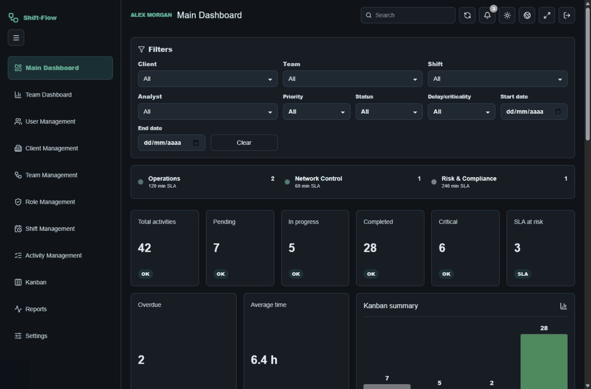

# Shift-Flow

[](https://github.com/DegsTerin/Shift-Flow/actions/workflows/release-gates.yml)

Shift-Flow is an operations workspace for teams that coordinate shifts, service activities, ownership, controls and reporting. It brings live workload visibility, governed activity records and permission-aware administration into one responsive Web application.

[Open the live Render demonstration](https://shift-flow-degsterin.onrender.com). Authentication is required; demonstration credentials are delivered privately and are never stored in the repository.

## Product walkthrough



The walkthrough uses the real local Web interface with immutable synthetic responses. It demonstrates product behaviour and visual design; it is not evidence of a production backend or production data.

## What it delivers

- Main and team dashboards with operational metrics, attention indicators, configurable widgets and TV mode.
- Activity management across list, Kanban and detailed record views, including timelines and an internal task board.
- Shift, team, client, user and role administration with permission-scoped navigation.
- Notification centre, global search, filters and operational reporting.
- Responsive layouts, light and dark themes, and `pt-BR` / `en-GB` interface support.
- Structured audit, request-correlation, authentication, rate-limit and tenant-boundary controls.

## Architecture

| Layer                  | Current responsibility                                                    |
| ---------------------- | ------------------------------------------------------------------------- |
| Web                    | Next.js and React application written in strict TypeScript.               |
| Incumbent API          | Modular Express REST API and the current compatibility surface.           |
| Migration host         | ASP.NET Core compatibility host for the routed Audit slice.               |
| Durable data           | PostgreSQL, with Prisma as the sole schema and migration owner.           |
| Migration dependencies | Redis-backed distributed state and an allowlisted Nginx same-origin edge. |

The repository deliberately supports two distinct runtime shapes:

1. The controlled local strangler profile runs Next.js, Express, ASP.NET Core, PostgreSQL, Redis and Nginx. It validates migration boundaries in disposable containers.
2. The Render demonstration uses a single native Node.js listener for the incumbent Next.js and Express applications, backed by PostgreSQL. Keeping Web and API on one public hostname preserves the existing refresh-cookie, CSRF and origin contract. This demonstration does not promote the ASP.NET Core migration profile and is not production approval.

REST remains the canonical public contract. GraphQL and an external OAuth 2.0 / OpenID Connect provider remain deferred until there is measured product need and approved identity authority.

## Technology

- Next.js 16, React 19 and TypeScript
- Node.js and Express
- ASP.NET Core and Npgsql
- PostgreSQL, Prisma and Redis
- Nginx and Docker Compose
- Vitest, MSTest and Playwright
- ESLint, Prettier and strict TypeScript checks
- GitHub Actions release gates

## Repository layout

```text
apps/
  api/         Express API and shared infrastructure
  api-dotnet/  ASP.NET Core compatibility host and focused tests
  web/         Next.js application
docs/          Architecture, operations and delivery documentation
eng/           Reproducible development workflow and canonical gates
infra/         Container, edge and Render runtime definitions
prisma/        Schema, approved migrations and deterministic seeds
scripts/       Maintenance, policy and focused regression checks
tests/e2e/     End-to-end, accessibility and load checks
```

## Prerequisites

- Node.js and npm versions compatible with the lockfile
- PowerShell 7+
- Docker Desktop for PostgreSQL and disposable runtime validation
- .NET 10 SDK for the compatibility host

Run the read-only environment diagnosis first:

```powershell
./eng/development.ps1 Doctor
```

The full toolchain and offline behaviour are documented in [Project Setup and Development Workflow](docs/PROJECT-SETUP.md).

## Local development

Prepare locked dependencies and generated clients:

```powershell
./eng/development.ps1 Setup
Copy-Item .env.example .env
```

Replace the local-only placeholder secrets in `.env`, keep `POSTGRES_PASSWORD` aligned with `DATABASE_URL`, then start PostgreSQL and apply the approved migrations:

```powershell
docker compose up -d postgres
npx prisma migrate deploy
```

Seed a disposable local database only when required. Seed credentials are runtime values and must never be committed:

```powershell
$env:E2E_EMAIL = "demo@shiftflow.local"
$env:E2E_PASSWORD = "<strong-local-password>"
npm run seed:integration
npm run homologation:seed
```

Start the managed Web and Express development platform:

```powershell
npm run platform:start
```

The managed platform exposes Web at `http://localhost:3000` and API at `http://localhost:3001`. Use `npm run platform:status`, `npm run platform:restart` and `npm run platform:stop` for lifecycle control. The scripts act only on processes whose recorded identity belongs to this repository.

`AUTH_MODE=demo` is local development functionality. Production configuration rejects it and always requires authentication.

## Quality gates

Use the quick lane for development feedback:

```powershell
./eng/development.ps1 Quick
```

`Quick` is explicitly non-gating. Before a release candidate, run the canonical core gate:

```powershell
./eng/development.ps1 Full
```

The disposable migration-topology gate is separate:

```powershell
npm run test:runtime:strangler
```

It creates isolated credentials and infrastructure, tests real routed behaviour and removes its containers and volumes after the run. A green local gate is evidence for that candidate only; it is not production approval.

## Operations and security

- `GET /health` reports process liveness; `GET /ready` checks required incumbent dependencies.
- API responses carry request-correlation identifiers and structured operational logs.
- Unsafe requests are protected by the same-origin and CSRF contract.
- Production secrets belong in the deployment provider's secret store and are excluded from Git.
- Suspected vulnerabilities should follow [SECURITY.md](SECURITY.md), not a public issue.

Deployment order, migration boundaries, rollback requirements and incident handling are defined in the [Production Runbook](docs/production-runbook.md).

## Documentation

- [Architecture](docs/architecture.md)
- [Contributing](CONTRIBUTING.md)
- [Development standards](docs/development-standards.md)
- [Governance index](docs/governance-index.md)
- [Project setup](docs/PROJECT-SETUP.md)
- [Production runbook](docs/production-runbook.md)
- [Technical roadmap](docs/technical-roadmap.md)

## Licence

The project declares `UNLICENSED`. Publication of the source code does not grant
an open-source licence or redistribution rights.
